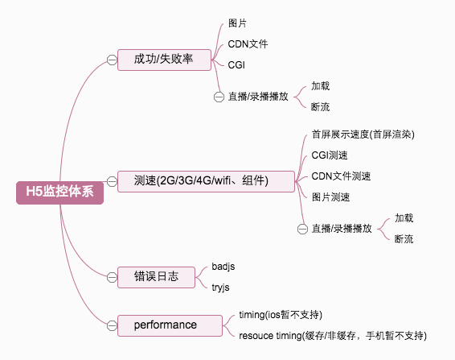

#移动端技术数据上报规范
+   移动端来源区分
    +   所有的上报都需要区分网络状态
        +   格式为 -[网络状态]-
        +   参照mmq返回值
        +   0 - 未知网络
        +   1 - WIFI
        +   2 - 2G
        +   3 - 3G
        +   4 - 4G
    +   根据场景需要，区分手Q 和 其他非手Q数据，微信上报`[此处可选]`
        +   QQ 手机QQ
        + MicroMessager 微信
        + 其他场景自行选择浏览器的user-agent
+   页面测速(工具化)
    +   html 页面需要上报Navigation Timing
        +   `参见performance.timing`
        +   使用测速系统自动上报点
    +   页面测速需要区分离线包&非离线包
        +   pack 离线包
        +   unpack 非离线包
    +   CGI测速上报mm系统
        +   network-[网络状态]-url
    +   页面打点可以自行处理，需要包含以下测速点
        +   页面底部 dom-end
        +   js加载完成 js-end
        +   js执行完成 js-called-end
        +   数据加载完成 data-load-end
        +   数据渲染完成 data-render-end
        +   *首屏速度 first-screen*
            +   `首屏依赖数据的话，首屏速度参照data-render-end，反之，参照js-called-end`
    +   异步加载的文件测速（js/css/第三方资源）
        +   速度上报测速系统
        +   带上网络状态以及离线包情况
        +   js-load-xxx/css-load-xxx/img-load-xxx/file-load-xxx
+   失败率
    +   文件加载失败率（css、js、图片[必要场景]）
    +   首屏关键图片监控(失败率/测速/区分首次与非首次)`[可选]`
+   日志信息
    +   CGI拉取失败错误
        +   信息包含网络状态、错误码、url地址
        +   格式：network-[网络状态]-url
    +   必要的关键路径上报`[可选]`
    +   tryjs堆栈上报(如果有)
    +   local 异常上报

